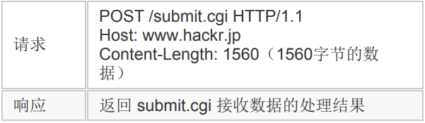

注：目前仅包含阅读《图解HTTP》所记录笔记，大部分内容待补充，某些部分个人已理解，因此不在此花费时间描述。

# 一 Web网络基础


## TCP/IP协议族

计算机和网络设备间若要通信，就必须基于相同的规则，这种规则就叫做协议(protocol)。协议包括各种内容，互联网相关协议总称为TCP/IP，通常使用的网络都是在TCP/IP协议族的基础上运作的。

TCP/IP协议族按层次分为：

- **应用层**：决定向用户提供应用服务时通信的活动。TCP/IP协议族内预存了各类通用的应用服务如FTP和DNS，HTTP也处于该层。
- **传输层**：向应用层提供处于网络连接中的两台计算机间的数据传输。有两个性质不同的协议——TCP和UDP。
- **网络层**：规定传输路线并传送数据包(网络传输最小单位)。
- **数据链路层**：网络连接的硬件部分，包括OS、设备驱动、NIC、光纤等。

如下图：客户端使用HTTP协议发出请求，为传输方便，TCP协议将接收到的HTTP请求报文分割并标记序号和端口号，然后IP协议为其增加作为通信目的的MAC地址后转发给链路层；服务器在链路层接收到数据后逐层向上传输并去掉对应的首部，当传输到应用层才算真正接收到这个请求。


### IP/TCP/DNS

**IP协议**负责传输数据包，几乎所有使用网络的系统都会用到。为保证确实的传送，需要IP地址和MAC地址。IP地址指明节点被分配到的地址，可变；MAC地址指网卡所属固定地址，基本不变。IP间通信依赖MAC地址，**ARP协议**可根据IP地址反查出MAC地址。双方通信通常要经过多台设备的中转，中转时，就是用下一站中转设备的MAC地址来搜索下一个中转目标。传输中的每个节点都无法获悉整个传输路线的全貌，这个机制称作**路由选择(routing)**。

位于传输层的**TCP协议**提供可靠的**字节流服务**。为方便传输，将大块数据分割为以报文段(segment)为单位的数据包进行管理；为准确无误将数据送至目标，TCP协议采用三次握手策略：发送端首先发送一个带SYN标志的数据包，接收端收到后，回传一个带有SYN/ACK标志的数据包以示传达确认信息，最后，发送端再回传一个带ACK标志的数据包，代表“握手”结束。这里的SYN (synchronize)和ACK (acknowledgement)都是TCP的标志，若某个阶段莫名中断则会再次以相同顺序发送相同数据包。

**DNS协议**位于应用层，提供从域名到IP地址，从IP地址反查域名的解析服务。


## URI和URL

 **URI(Uniform Resource Identifier)**是由某个协议方案表示资源定位标识符。规定统一格式便于处理不同类型的资源，不必根据环境来识别资源指定的访问方式，加入新增的协议方案也更容易；“资源”的定义是“可标识的任何东西”，也可以是多数内容的集合体。标准URI协议方案有30多种，由IANA管理颁布。

URI用字符串标识某一互联网资源，而**URL(Uniform Resource Locator)**表示资源在互联网所处的位置，即URL是URI的子集。

绝对URI格式如下：


- 协议名不区分大小写；
- 登录信息是从服务器端获取资源时必要的身份认证信息，可选；
- 服务器地址可以是域名，也可以是IPv4或IPv6地址名；
- 服务器端口号可选，省略则使用默认端口号；
- 文件路径用于在服务器种定位需要的资源；
- 针对文件路径内的资源，可以使用查询字符串可传入任意参数，可选；
- 片段标识符可标记出已获取资源中的子资源，可选；


# 二 HTTP协议

应用HTTP协议的双方通信时，发送请求的一方担任客户端，提供资源响应的一方作为服务端。HTTP协议规定由客户端发出请求报文并开始建立通信，服务端在没有接收到请求之前不会发送响应。为处理大量事务和确保协议可伸缩性，HTTP协议被涉及的十分简单，而被应用在各种场景中。


## HTTP报文

 用于 HTTP 协议交互的信息被称为HTTP报文，其本身是由多行(CR+LF作换行符)数据构成的字符串文本。

最初出现的空行将报文划分为报文首部和报文主体。请求报文首部第一行为**请求行**，包含请求的方法，URL和HTTP版本；响应报文首部第一为**状态行**，包含表明响应结果的状态码，原因短语和HTTP版本。首部字段表示请求和响应的各种条件和属性。

 **实体(entity)**作为请求或响应的有效载荷数据（补充项）被传输，其内容由实体首部和实体主体组成。 HTTP 报文的主体用于传输请求或响应的实体主体。  通常，报文主体等于实体主体。只有当传输中进行编码操作时，实体主 体的内容发生变化，才导致它和报文主体产生差异。 

```http
// 请求报文
GET /index.htm HTTP/1.1
Host: hackr.jp
Content-Type: application/x-www-form-urlencoded
Content-Length: 16
// 服务端的响应
HTTP/1.1 200 OK
Date: Tue, 10 Jul 2012 06:50:15 GMT
Content-Length: 362
Content-Type: text/html
<html>...
```

- 请求：“GET”表示请求类型，称作方法；“/index.htm”指明请求访问的资源对象，也叫请求URI(request-URI)；“HTTP/1.1”表示HTTP的版本。这之后的内容为首部字段，首部字段的“Host”可写明域名或IP地址。
- 响应：“HTTP/1.1”表示HTTP的版本；“200”是表示请求处理结果的状态码(status code)，“OK”是原因短语(reason-phrase)；下一行是响应创建的日期时间。之后的内容为首部字段。空一行后的内容为资源主体。

HTTP在传输时可通过**编码**提升传输速率，编码的操作由计算机完成，需要消耗一定CPU等资源。传输大容量数据时，可以把数据分割成多块传输，称作**分块传输编码(Chunked Transfer Coding)**。MIME扩展中有称作**Multipart**的方法来容纳多种不同类型的数据，HTTP也采用了Multipart，使用时要在首部字段加上`Content-type`，再使用`boundary`来划分Multipart指明的各类实体。通过`Range`可以指定资源的byte范围来分批请求资源。同一Web界面中可能存在多份内容相同但语言不同的界面，服务器端和客户端会就响应的资源内容进行交涉选取最合适的资源，这称作**内容协商(Content Negotiation)**。


## 请求方法

**GET：获取资源**

GET 方法用来请求访问已被 URI 识别的资源。指定资源经服务器端解析后返回响应内容。如果请求文本，则原样返回；如果是像 CGI(Common Gateway Interface，通用网关接口)那样的程序，则返回经过执行后的输出结果。


**POST：传输实体主体**

 虽然用 GET 方法也可以传输实体的主体，但一般用 POST 进行传输。




 **PUT：传输文件** 

 PUT 方法用来传输文件。就像 FTP 协议的文件上传。在请求报文的主体中包含文件内容，保存到请求 URI 指定的位置。 鉴于 HTTP/1.1 的 PUT 不带验证，存在安全问题，因此一般网站不使用该方法。若配合 Web 应用程序的验证机制，或架构设计采用 REST(REpresentational State Transfer，表征状态转移)标准的同类 Web 网站，就可能会开放使用 PUT 方法。


**HEAD：获得报文首部** 

 HEAD 方法和 GET 方法一样，只是不返回报文主体部分，用于确认 URI 的有效性及资源更新的日期时间等。 


**DELETE：删除文件**

 DELETE 方法按 请求 URI 删除指定的资源， 是与 PUT 相反的方法，同 PUT 一样要在特定条件下才会被开放使用。


**OPTIONS：询问支持的方法**

 OPTIONS 方法用来查询针对请求 URI 指定的资源支持的方法。 


**TRACE：追踪路径**

 TRACE 方法是让 Web 服务器端将之前的请求通信环回给客户端的方法。 发送请求时，在 Max-Forwards 首部字段中填入数值，每经过一个服务器端就将该数字减 1，当数值刚好减到 0 时，就停止继续传输，最后接收到请求的服务器端则返回状态码 200 OK 的响应。

 客户端通过 TRACE 可以查询发出去的请求是怎样被加工修改/ 篡改的。这是因为，请求想要连接到源目标服务器可能会通过代理中转，TRACE 方法就是用来确认连接过程中发生的一系列操作。 但TRACE不常用，而且容易引发引发 XST (Cross-Site Tracing，跨站追踪)攻击，通常就更不会用到了。 


**CONNECT：要求用隧道协议连接代理**

 CONNECT 方法要求在与代理服务器通信时建立隧道，实现用隧道协 议进行 TCP 通信。主要使用 SSL(Secure Sockets Layer，安全套接层)和 TLS (Transport Layer Security，传输层安全)协议把通信内容加密后经网络隧道传输。


## 状态码

状态码的描述了请求的处理结果，由3位数字和原因短语组成，数字第一位指示响应类别(共5种)，后两位无分类。经常使用的状态码大概只有14种。

- 1XX——Informational（信息性状态码）——接收的请求正在处理；
- 2XX——Success（成功状态码）——请求正常处理完毕；
- 3XX——Redirection（重定向状态码）——需要进行附加操作以完成请求 ；
- 4XX——Client Error（客户端错误状态码）——服务器无法处理请求；
- 5XX——Server Error（服务器错误 状态码）——服务器处理请求出错。


### 1XX 消息

这一类型的状态码，代表请求已被接受，需要继续处理。


### 2XX 成功

 2XX 的响应结果表明请求被正常处理了。


**200 OK**

 表示从客户端发来的请求在服务器端被正常处理了。 响应报文内随状态码一起返回的信息因方法的不同而不同。 


**204 No Content**

 该状态码代表服务器接收的请求已成功处理，但在返回的响应报文中不含实体的主体部分，也不允许返回任何实体的主体。 一般在只需要从客户端往服务器发送信息，而对客户端不需要发送新信 息内容的情况下使用。 


**206 Partial Content**

 该状态码表示客户端进行了范围请求，而服务器成功执行了这部分的 GET 请求。响应报文中包含由 Content-Range 指定范围的实体内容。 


###  3XX 重定向

 3XX 响应结果表明浏览器需要执行某些特殊的处理以正确处理请求。 


 **301 Moved Permanently**

 永久性重定向。该状态码表示请求的资源已被分配了新的 URI，以后应使用资源现在所指的 URI。


**302 Found**

 临时性重定向。该状态码表示请求的资源已被分配了新的 URI，希望用户（本次）能使用新的 URI 访问。 和 301 Moved Permanently 状态码相似，但 302 状态码代表的资源不 是被永久移动，只是临时性质的。换句话说，已移动的资源对应的 URI 将来还有可能发生改变。 


**303 See Other**

 表示由于请求对应的资源存在着另一个 URI，应使用 GET 方法定向获取请求的资源。  303 状态码和 302 Found 状态码有着相同的功能，但 303 状态码明确表示客户端应当采用 GET 方法获取资源，这点与 302 状态码有区别。 

 当 301、302、303 响应状态码返回时，几乎所有的浏览器都会把 POST 改成 GET，并删除请求报文内的主体，之后请求会自动再次 发送。 301、302 标准是禁止将 POST 方法改变成 GET 方法的，但实际使 用时大家都会这么做。


**304 Not Modified**

 该状态码表示客户端发送附带条件的请求时，服务器端允许请求访问 资源，但未满足条件的情况。304 状态码返回时，不包含任何响应的主体部分。304 虽然被划分在 3XX 类别中，但是和重定向没有关系。 

*附带条件的请求指采用 GET 方法的请求报文中包含 If-Match，If-Modified-Since，If-NoneMatch，If-Range，If-Unmodified-Since 中任一首部。*


**307 Temporary Redirect**

 临时重定向。该状态码与 302 Found 有着相同的含义。尽管 302 标准禁止 POST 变换成 GET，但实际使用时大家并不遵守。 307 会遵照浏览器标准，不会从 POST 变成 GET。但是，对于处理响应时的行为，每种浏览器有可能出现不同的情况。


###  4XX 客户端错误

 4XX 的响应结果表明客户端是发生错误的原因所在。 


**400 Bad Request**

 该状态码表示请求报文中存在语法错误。当错误发生时，需修改请求的内容后再次发送请求。另外，浏览器会像 200 OK 一样对待该状态码。


**401 Unauthorized**

 该状态码表示发送的请求需要有通过 HTTP 认证（BASIC 认证、 DIGEST 认证）的认证信息。 返回含有 401 的响应必须包含一个适用于被请求资源的 WWWAuthenticate 首部用以质询（challenge）用户信息。当浏览器初次接收 到 401 响应，会弹出认证用的对话窗口。 


**403 Forbidden**

 该状态码表明对请求资源的访问被服务器拒绝了。服务器端没有必要给 出拒绝的详细理由，但如果想作说明的话，可以在实体的主体部分对原 因进行描述，这样就能让用户看到了。 未获得文件系统的访问授权，访问权限出现某些问题（从未授权的发送 源 IP 地址试图访问）等列举的情况都可能是发生 403 的原因。 


**404 Not Found**

 该状态码表明服务器上无法找到请求的资源。除此之外，也可以在服务器端拒绝请求且不想说明理由时使用。 


###  5XX 服务器错误 

 5XX 的响应结果表明服务器本身发生错误。 


**500 Internal Server Error**

 该状态码表明服务器端在执行请求时发生了错误。也有可能是 Web 应 用存在的 bug 或某些临时的故障。 


**503 Service Unavailable**

该状态码表明服务器暂时处于超负载或正在进行停机维护，现在无法处 理请求。如果事先得知解除以上状况需要的时间，最好写入 RetryAfter 首部字段再返回给客户端。


## 【状态码具体】

### 概述

所有HTTP响应的第一行都是**状态行**，依次是当前HTTP版本号，3位数字组成的[状态代码](https://zh.wikipedia.org/wiki/HTTP状态码)，以及描述状态的短语，彼此由空格分隔。

状态代码的第一个数字代表当前响应的类型：

- [1xx消息](https://zh.wikipedia.org/wiki/HTTP状态码#1xx消息)——请求已被服务器接收，继续处理
- [2xx成功](https://zh.wikipedia.org/wiki/HTTP状态码#2xx成功)——请求已成功被服务器接收、理解、并接受
- [3xx重定向](https://zh.wikipedia.org/wiki/HTTP状态码#3xx重定向)——需要后续操作才能完成这一请求
- [4xx请求错误](https://zh.wikipedia.org/wiki/HTTP状态码#4xx请求错误)——请求含有词法错误或者无法被执行
- [5xx服务器错误](https://zh.wikipedia.org/wiki/HTTP状态码#5xx服务器错误)——服务器在处理某个正确请求时发生错误

虽然 [RFC 2616](https://tools.ietf.org/html/rfc2616) 中已经推荐了描述状态的短语，例如"200 OK"，"[404 Not Found](https://zh.wikipedia.org/wiki/HTTP_404)"，但是WEB开发者仍然能够自行决定采用何种短语，用以显示本地化的状态描述或者自定义信息。


1xx消息

这一类型的状态码，代表请求已被接受，需要继续处理。这类响应是临时响应，只包含状态行和某些可选的响应头信息，并以空行结束。由于HTTP/1.0协议中没有定义任何1xx状态码，所以除非在某些试验条件下，服务器禁止向此类客户端发送1xx响应。[[4\]](https://zh.wikipedia.org/wiki/HTTP状态码#cite_note-4) 这些状态码代表的响应都是信息性的，标示客户应该采取的其他行动。

- 100 Continue

  服务器已经接收到请求头，并且客户端应继续发送请求主体（在需要发送身体的请求的情况下：例如，POST请求），或者如果请求已经完成，忽略这个响应。服务器必须在请求完成后向客户端发送一个最终响应。要使服务器检查请求的头部，客户端必须在其初始请求中发送`Expect: 100-continue`作为头部，并在发送正文之前接收`100 Continue`状态代码。响应代码417期望失败表示请求不应继续。[[2\]](https://zh.wikipedia.org/wiki/HTTP状态码#cite_note-iana_status_codes-2)

- 101 Switching Protocols

  服务器已经理解了客户端的请求，并将通过Upgrade消息头通知客户端采用不同的协议来完成这个请求。在发送完这个响应最后的空行后，服务器将会切换到在Upgrade消息头中定义的那些协议。[[5\]](https://zh.wikipedia.org/wiki/HTTP状态码#cite_note-5)

  只有在切换新的协议更有好处的时候才应该采取类似措施。例如，切换到新的HTTP版本（如[HTTP/2](https://zh.wikipedia.org/wiki/HTTP/2)）比旧版本更有优势，或者切换到一个实时且同步的协议（如[WebSocket](https://zh.wikipedia.org/wiki/WebSocket)）以传送利用此类特性的资源。

- 102 Processing（[WebDAV](https://zh.wikipedia.org/wiki/WebDAV)；[RFC 2518](https://tools.ietf.org/html/rfc2518)）

  WebDAV请求可能包含许多涉及文件操作的子请求，需要很长时间才能完成请求。该代码表示服务器已经收到并正在处理请求，但无响应可用。[[6\]](https://zh.wikipedia.org/wiki/HTTP状态码#cite_note-RFC_2518-6)这样可以防止客户端超时，并假设请求丢失。

  

### 2xx成功

这一类型的状态码，代表请求已成功被服务器接收、理解、并接受。[[2\]](https://zh.wikipedia.org/wiki/HTTP状态码#cite_note-iana_status_codes-2)

- 200 OK

  请求已成功，请求所希望的响应头或数据体将随此响应返回。实际的响应将取决于所使用的请求方法。在GET请求中，响应将包含与请求的资源相对应的实体。在POST请求中，响应将包含描述或操作结果的实体。[[7\]](https://zh.wikipedia.org/wiki/HTTP状态码#cite_note-RFC_2616-7)

- 201 Created

  请求已经被实现，而且有一个新的资源已经依据请求的需要而创建，且其[URI](https://zh.wikipedia.org/wiki/URI)已经随Location头信息返回。假如需要的资源无法及时创建的话，应当返回'[202 Accepted](https://zh.wikipedia.org/wiki/HTTP状态码#202)'。[[8\]](https://zh.wikipedia.org/wiki/HTTP状态码#cite_note-8)

- 202 Accepted

  服务器已接受请求，但尚未处理。最终该请求可能会也可能不会被执行，并且可能在处理发生时被禁止。[[9\]](https://zh.wikipedia.org/wiki/HTTP状态码#cite_note-9)

- 203 Non-Authoritative Information（自HTTP / 1.1起）

  服务器是一个转换代理服务器（transforming proxy，例如[网络加速器](https://zh.wikipedia.org/wiki/網絡加速器)），以`200 OK`状态码为起源，但回应了原始响应的修改版本。[[10\]](https://zh.wikipedia.org/wiki/HTTP状态码#cite_note-10)[[11\]](https://zh.wikipedia.org/wiki/HTTP状态码#cite_note-11)

- 204 No Content

  服务器成功处理了请求，没有返回任何内容。[[12\]](https://zh.wikipedia.org/wiki/HTTP状态码#cite_note-12)在[强制门户](https://zh.wikipedia.org/wiki/强制门户)功能中，Wifi设备连接到需要进行Web认证的Wifi接入点时，通过访问一个能生成HTTP 204响应的的网站，如果能正常收到204响应，则代表无需Web认证，否则会弹出网页浏览器界面，显示出Web网页认证界面用于让用户认证登录。

- 205 Reset Content

  服务器成功处理了请求，但没有返回任何内容。与204响应不同，此响应要求请求者重置文档视图。[[13\]](https://zh.wikipedia.org/wiki/HTTP状态码#cite_note-13)

- 206 Partial Content（[RFC 7233](https://tools.ietf.org/html/rfc7233)）

  服务器已经成功处理了部分GET请求。类似于[FlashGet](https://zh.wikipedia.org/wiki/FlashGet)或者[迅雷](https://zh.wikipedia.org/wiki/迅雷)这类的HTTP[下载工具](https://zh.wikipedia.org/wiki/Category:下載工具)都是使用此类响应实现断点续传或者将一个大文档分解为多个下载段同时下载。[[14\]](https://zh.wikipedia.org/wiki/HTTP状态码#cite_note-14)

- 207 Multi-Status（WebDAV；[RFC 4918](https://tools.ietf.org/html/rfc4918)）

  代表之后的消息体将是一个[XML](https://zh.wikipedia.org/wiki/XML)消息，并且可能依照之前子请求数量的不同，包含一系列独立的响应代码。[[15\]](https://zh.wikipedia.org/wiki/HTTP状态码#cite_note-RFC_4918-15)

- 208 Already Reported （WebDAV；[RFC 5842](https://tools.ietf.org/html/rfc5842)）

  DAV绑定的成员已经在（多状态）响应之前的部分被列举，且未被再次包含。

- 226 IM Used （[RFC 3229](https://tools.ietf.org/html/rfc3229)）

  服务器已经满足了对资源的请求，对实体请求的一个或多个实体操作的结果表示。[[16\]](https://zh.wikipedia.org/wiki/HTTP状态码#cite_note-RFC_3229-16)


### 3xx重定向

这类状态码代表需要客户端采取进一步的操作才能完成请求。通常，这些状态码用来重定向，后续的请求地址（重定向目标）在本次响应的Location域中指明。[[2\]](https://zh.wikipedia.org/wiki/HTTP状态码#cite_note-iana_status_codes-2)

当且仅当后续的请求所使用的方法是GET或者HEAD时，用户[浏览器](https://zh.wikipedia.org/wiki/浏览器)才可以在没有用户介入的情况下自动提交所需要的后续请求。客户端应当自动监测[无限循环](https://zh.wikipedia.org/wiki/死循環)重定向（例如：A→B→C→……→A或A→A），因为这会导致服务器和客户端大量不必要的资源消耗。按照HTTP/1.0版规范的建议，浏览器不应自动访问超过5次的重定向。[[17\]](https://zh.wikipedia.org/wiki/HTTP状态码#cite_note-17)

- 300 Multiple Choices

  被请求的资源有一系列可供选择的回馈信息，每个都有自己特定的地址和浏览器驱动的商议信息。用户或浏览器能够自行选择一个首选的地址进行重定向。[[18\]](https://zh.wikipedia.org/wiki/HTTP状态码#cite_note-18)

  除非这是一个HEAD请求，否则该响应应当包括一个资源特性及地址的列表的实体，以便用户或浏览器从中选择最合适的重定向地址。这个实体的格式由Content-Type定义的格式所决定。浏览器可能根据响应的格式以及浏览器自身能力，自动作出最合适的选择。当然，RFC 2616规范并没有规定这样的自动选择该如何进行。

  如果服务器本身已经有了首选的回馈选择，那么在Location中应当指明这个回馈的[URI](https://zh.wikipedia.org/wiki/URI)；浏览器可能会将这个Location值作为自动重定向的地址。此外，除非额外指定，否则这个响应也是可缓存的。

- [301 Moved Permanently](https://zh.wikipedia.org/wiki/HTTP_301)

  被请求的资源已永久移动到新位置，并且将来任何对此资源的引用都应该使用本响应返回的若干个URI之一。如果可能，拥有链接编辑功能的客户端应当自动把请求的地址修改为从服务器反馈回来的地址。[[19\]](https://zh.wikipedia.org/wiki/HTTP状态码#cite_note-19)除非额外指定，否则这个响应也是可缓存的。

  新的永久性的URI应当在响应的Location域中返回。除非这是一个HEAD请求，否则响应的实体中应当包含指向新的URI的[超链接](https://zh.wikipedia.org/wiki/超链接)及简短说明。

  如果这不是一个GET或者HEAD请求，那么浏览器禁止自动进行重定向，除非得到用户的确认，因为请求的条件可能因此发生变化。

  注意：对于某些使用HTTP/1.0协议的浏览器，当它们发送的POST请求得到了一个301响应的话，接下来的重定向请求将会变成GET方式。

- [302 Found](https://zh.wikipedia.org/wiki/HTTP_302)

  要求客户端执行临时重定向（原始描述短语为“Moved Temporarily”）。[[20\]](https://zh.wikipedia.org/wiki/HTTP状态码#cite_note-RFC_1945-20)由于这样的重定向是临时的，客户端应当继续向原有地址发送以后的请求。只有在Cache-Control或Expires中进行了指定的情况下，这个响应才是可缓存的。

  新的临时性的URI应当在响应的Location域中返回。除非这是一个HEAD请求，否则响应的实体中应当包含指向新的URI的超链接及简短说明。

  如果这不是一个GET或者HEAD请求，那么浏览器禁止自动进行重定向，除非得到用户的确认，因为请求的条件可能因此发生变化。

  注意：虽然RFC 1945和RFC 2068规范不允许客户端在重定向时改变请求的方法，但是很多现存的浏览器将302响应视作为[303响应](https://zh.wikipedia.org/wiki/HTTP状态码#303)，并且使用GET方式访问在Location中规定的URI，而无视原先请求的方法。[[21\]](https://zh.wikipedia.org/wiki/HTTP状态码#cite_note-ruby-on-rails-ActionController-Redirecting-redirect_to-21)因此状态码303和[307](https://zh.wikipedia.org/wiki/HTTP状态码#307)被添加了进来，用以明确服务器期待客户端进行何种反应。[[22\]](https://zh.wikipedia.org/wiki/HTTP状态码#cite_note-RFC7230-10-22)

- [303 See Other](https://zh.wikipedia.org/wiki/HTTP_303)

  对应当前请求的响应可以在另一个URI上被找到，当响应于POST（或PUT / DELETE）接收到响应时，客户端应该假定服务器已经收到数据，并且应该使用单独的GET消息发出重定向。[[23\]](https://zh.wikipedia.org/wiki/HTTP状态码#cite_note-23)这个方法的存在主要是为了允许由脚本激活的POST请求输出重定向到一个新的资源。这个新的URI不是原始资源的替代引用。同时，303响应禁止被缓存。当然，第二个请求（重定向）可能被缓存。

  新的URI应当在响应的Location域中返回。除非这是一个HEAD请求，否则响应的实体中应当包含指向新的URI的超链接及简短说明。

  注意：许多HTTP/1.1版以前的浏览器不能正确理解303状态。如果需要考虑与这些浏览器之间的互动，[302状态码](https://zh.wikipedia.org/wiki/HTTP状态码#302)应该可以胜任，因为大多数的浏览器处理302响应时的方式恰恰就是上述规范要求客户端处理303响应时应当做的。

- 304 Not Modified

  表示资源在由请求头中的If-Modified-Since或If-None-Match参数指定的这一版本之后，未曾被修改。在这种情况下，由于客户端仍然具有以前下载的副本，因此不需要重新传输资源。[[24\]](https://zh.wikipedia.org/wiki/HTTP状态码#cite_note-24)

- 305 Use Proxy

  被请求的资源必须通过指定的代理才能被访问。Location域中将给出指定的代理所在的URI信息，接收者需要重复发送一个单独的请求，通过这个代理才能访问相应资源。只有原始服务器才能创建305响应。许多HTTP客户端（像是[Mozilla](https://zh.wikipedia.org/wiki/Mozilla)[[25\]](https://zh.wikipedia.org/wiki/HTTP状态码#cite_note-mozilla_bugzilla_bug_187996-25)和[Internet Explorer](https://zh.wikipedia.org/wiki/Internet_Explorer)）都没有正确处理这种状态代码的响应，主要是出于安全考虑。[[26\]](https://zh.wikipedia.org/wiki/HTTP状态码#cite_note-mozilla_bugzilla_bug_187996_comment_13-26)

  注意：RFC 2068中没有明确305响应是为了重定向一个单独的请求，而且只能被原始服务器创建。忽视这些限制可能导致严重的安全后果。

- 306 Switch Proxy

  在最新版的规范中，306状态码已经不再被使用。最初是指“后续请求应使用指定的代理”。[[27\]](https://zh.wikipedia.org/wiki/HTTP状态码#cite_note-27)

- [307 Temporary Redirect](https://zh.wikipedia.org/wiki/HTTP_307)

  在这种情况下，请求应该与另一个URI重复，但后续的请求应仍使用原始的URI。 与302相反，当重新发出原始请求时，不允许更改请求方法。 例如，应该使用另一个POST请求来重复POST请求。[[28\]](https://zh.wikipedia.org/wiki/HTTP状态码#cite_note-SemanticsAndContent-28)

- 308 Permanent Redirect ([RFC 7538](https://tools.ietf.org/html/rfc7538))

  请求和所有将来的请求应该使用另一个URI重复。 307和308重复302和301的行为，但不允许HTTP方法更改。 例如，将表单提交给永久重定向的资源可能会顺利进行。[[29\]](https://zh.wikipedia.org/wiki/HTTP状态码#cite_note-rfc7238-29)


### 4xx客户端错误

这类的状态码代表了客户端看起来可能发生了错误，妨碍了服务器的处理。除非响应的是一个HEAD请求，否则服务器就应该返回一个解释当前错误状况的实体，以及这是临时的还是永久性的状况。这些状态码适用于任何请求方法。浏览器应当向用户显示任何包含在此类错误响应中的实体内容。[[30\]](https://zh.wikipedia.org/wiki/HTTP状态码#cite_note-30)

如果错误发生时客户端正在传送数据，那么使用[TCP](https://zh.wikipedia.org/wiki/传输控制协议)的服务器实现应当仔细确保在关闭客户端与服务器之间的连接之前，客户端已经收到了包含错误信息的[数据包](https://zh.wikipedia.org/wiki/数据包)。如果客户端在收到错误信息后继续向服务器发送数据，服务器的TCP栈将向客户端发送一个重置数据包，以清除该客户端所有还未识别的输入[缓冲](https://zh.wikipedia.org/w/index.php?title=缓冲&action=edit&redlink=1)，以免这些数据被服务器上的[应用程序](https://zh.wikipedia.org/wiki/应用程序)读取并干扰后者。

- 400 Bad Request

  由于明显的客户端错误（例如，格式错误的请求语法，太大的大小，无效的请求消息或欺骗性路由请求），服务器不能或不会处理该请求。[[31\]](https://zh.wikipedia.org/wiki/HTTP状态码#cite_note-rfc7231-400-31)

- 401 Unauthorized（[RFC 7235](https://tools.ietf.org/html/rfc7235)）

  参见：[HTTP基本认证](https://zh.wikipedia.org/wiki/HTTP基本认证)、[HTTP摘要认证](https://zh.wikipedia.org/wiki/HTTP摘要认证)

  类似于403 Forbidden，401语义即“[未认证](https://zh.wikipedia.org/wiki/身份验证)”，即用户没有必要的凭据。[[32\]](https://zh.wikipedia.org/wiki/HTTP状态码#cite_note-rfc7235-401-32)该状态码表示当前请求需要用户验证。该响应必须包含一个适用于被请求资源的WWW-Authenticate信息头用以询问用户信息。客户端可以重复提交一个包含恰当的Authorization头信息的请求。[[33\]](https://zh.wikipedia.org/wiki/HTTP状态码#cite_note-33)如果当前请求已经包含了Authorization证书，那么401响应代表着服务器验证已经拒绝了那些证书。如果401响应包含了与前一个响应相同的身份验证询问，且浏览器已经至少尝试了一次验证，那么浏览器应当向用户展示响应中包含的实体信息，因为这个实体信息中可能包含了相关诊断信息。

  注意：当网站（通常是网站域名）禁止IP地址时，有些网站状态码显示的401，表示该特定地址被拒绝访问网站。

- 402 Payment Required

  该状态码是为了将来可能的需求而预留的。该状态码最初的意图可能被用作某种形式的数字现金或在线支付方案的一部分，但几乎没有哪家服务商使用，而且这个状态码通常不被使用。如果特定开发人员已超过请求的每日限制，[Google Developers](https://zh.wikipedia.org/wiki/Google_Developers) API会使用此状态码。[[34\]](https://zh.wikipedia.org/wiki/HTTP状态码#cite_note-GoogleDevelopersErrorCode-34)

- 403 Forbidden

  服务器已经理解请求，但是拒绝执行它。与[401响应](https://zh.wikipedia.org/wiki/HTTP状态码#401)不同的是，身份验证并不能提供任何帮助，而且这个请求也不应该被重复提交。如果这不是一个HEAD请求，而且服务器希望能够讲清楚为何请求不能被执行，那么就应该在实体内描述拒绝的原因。当然服务器也可以返回一个[404响应](https://zh.wikipedia.org/wiki/HTTP状态码#404)，假如它不希望让客户端获得任何信息。 

- 404 Not Found

  请求失败，请求所希望得到的资源未被在服务器上发现，但允许用户的后续请求。[[35\]](https://zh.wikipedia.org/wiki/HTTP状态码#cite_note-35)没有信息能够告诉用户这个状况到底是暂时的还是永久的。假如服务器知道情况的话，应当使用[410状态码](https://zh.wikipedia.org/wiki/HTTP状态码#410)来告知旧资源因为某些内部的配置机制问题，已经永久的不可用，而且没有任何可以跳转的地址。404这个状态码被广泛应用于当服务器不想揭示到底为何请求被拒绝或者没有其他适合的响应可用的情况下。 

- 405 Method Not Allowed

  请求行中指定的请求方法不能被用于请求相应的资源。该响应必须返回一个Allow头信息用以表示出当前资源能够接受的请求方法的列表。例如，需要通过POST呈现数据的表单上的GET请求，或只读资源上的PUT请求。

  鉴于PUT，DELETE方法会对服务器上的资源进行写操作，因而绝大部分的[网页服务器](https://zh.wikipedia.org/wiki/网页服务器)都不支持或者在默认配置下不允许上述请求方法，对于此类请求均会返回405错误。

- 406 Not Acceptable

  参见：[内容协商](https://zh.wikipedia.org/wiki/内容协商)

  请求的资源的内容特性无法满足请求头中的条件，因而无法生成响应实体，该请求不可接受。[[36\]](https://zh.wikipedia.org/wiki/HTTP状态码#cite_note-36)

  除非这是一个HEAD请求，否则该响应就应当返回一个包含可以让用户或者浏览器从中选择最合适的实体特性以及地址栏表的实体。实体的格式由Content-Type头中定义的媒体类型决定。浏览器可以根据格式及自身能力自行作出最佳选择。但是，规范中并没有定义任何作出此类自动选择的标准。

- 407 Proxy Authentication Required（[RFC 2617](https://tools.ietf.org/html/rfc2617)）

  与[401响应](https://zh.wikipedia.org/wiki/HTTP状态码#401)类似，只不过客户端必须在代理服务器上进行身份验证。[[37\]](https://zh.wikipedia.org/wiki/HTTP状态码#cite_note-37)代理服务器必须返回一个Proxy-Authenticate用以进行身份询问。客户端可以返回一个Proxy-Authorization信息头用以验证。

- 408 Request Timeout

  请求超时。根据HTTP规范，客户端没有在服务器预备等待的时间内完成一个请求的发送，客户端可以随时再次提交这一请求而无需进行任何更改。[[38\]](https://zh.wikipedia.org/wiki/HTTP状态码#cite_note-38)

- 409 Conflict

  表示因为请求存在冲突无法处理该请求，例如多个同步更新之间的[编辑冲突](https://zh.wikipedia.org/w/index.php?title=编辑冲突&action=edit&redlink=1)。

- 410 Gone

  表示所请求的资源不再可用，将不再可用。当资源被有意地删除并且资源应被清除时，应该使用这个。在收到410状态码后，用户应停止再次请求资源。[[39\]](https://zh.wikipedia.org/wiki/HTTP状态码#cite_note-HTTP_410-39)但大多数服务端不会使用此状态码，而是直接使用[404状态码](https://zh.wikipedia.org/wiki/HTTP状态码#404)。

- 411 Length Required

  服务器拒绝在没有定义Content-Length头的情况下接受请求。在添加了表明请求消息体长度的有效Content-Length头之后，客户端可以再次提交该请求。[[40\]](https://zh.wikipedia.org/wiki/HTTP状态码#cite_note-40)

- 412 Precondition Failed（[RFC 7232](https://tools.ietf.org/html/rfc7232)）

  服务器在验证在请求的头字段中给出先决条件时，没能满足其中的一个或多个。[[41\]](https://zh.wikipedia.org/wiki/HTTP状态码#cite_note-41)这个状态码允许客户端在获取资源时在请求的元信息（请求头字段数据）中设置先决条件，以此避免该请求方法被应用到其希望的内容以外的资源上。

- 413 Request Entity Too Large（[RFC 7231](https://tools.ietf.org/html/rfc7231)）

  前称“Request Entity Too Large”，表示服务器拒绝处理当前请求，因为该请求提交的实体数据大小超过了服务器愿意或者能够处理的范围。[[42\]](https://zh.wikipedia.org/wiki/HTTP状态码#cite_note-42)此种情况下，服务器可以关闭连接以免客户端继续发送此请求。

  如果这个状况是临时的，服务器应当返回一个Retry-After的响应头，以告知客户端可以在多少时间以后重新尝试。

- 414 Request-URI Too Long（[RFC 7231](https://tools.ietf.org/html/rfc7231)）

  前称“Request-URI Too Long”，[[43\]](https://zh.wikipedia.org/wiki/HTTP状态码#cite_note-43)表示请求的URI长度超过了服务器能够解释的长度，因此服务器拒绝对该请求提供服务。通常将太多数据的结果编码为GET请求的查询字符串，在这种情况下，应将其转换为POST请求。[[44\]](https://zh.wikipedia.org/wiki/HTTP状态码#cite_note-44)这比较少见，通常的情况包括：本应使用POST方法的表单提交变成了GET方法，导致[查询字符串](https://zh.wikipedia.org/w/index.php?title=查询字符串&action=edit&redlink=1)过长。重定向URI“黑洞”，例如每次重定向把旧的URI作为新的URI的一部分，导致在若干次重定向后URI超长。客户端正在尝试利用某些服务器中存在的[安全漏洞](https://zh.wikipedia.org/wiki/安全漏洞)攻击服务器。这类服务器使用固定长度的缓冲读取或操作请求的URI，当GET后的参数超过某个数值后，可能会产生缓冲区溢出，导致任意代码被执行[[45\]](https://zh.wikipedia.org/wiki/HTTP状态码#cite_note-45)。没有此类漏洞的服务器，应当返回414状态码。

- 415 Unsupported Media Type

  对于当前请求的方法和所请求的资源，请求中提交的[互联网媒体类型](https://zh.wikipedia.org/wiki/互联网媒体类型)并不是服务器中所支持的格式，因此请求被拒绝。例如，客户端将图像上传格式为svg，但服务器要求图像使用上传格式为jpg。

- 416 Requested Range Not Satisfiable（[RFC 7233](https://tools.ietf.org/html/rfc7233)）

  前称“Requested Range Not Satisfiable”。[[46\]](https://zh.wikipedia.org/wiki/HTTP状态码#cite_note-46)客户端已经要求文件的一部分（[Byte serving](https://zh.wikipedia.org/w/index.php?title=Byte_serving&action=edit&redlink=1)），但服务器不能提供该部分。例如，如果客户端要求文件的一部分超出文件尾端。[[47\]](https://zh.wikipedia.org/wiki/HTTP状态码#cite_note-47)

- 417 Expectation Failed

  在请求头Expect中指定的预期内容无法被服务器满足，或者这个服务器是一个代理服显的证据证明在当前[路由](https://zh.wikipedia.org/wiki/路由)的下一个节点上，Expect的内容无法被满足。[[48\]](https://zh.wikipedia.org/wiki/HTTP状态码#cite_note-48)

- 418 I'm a teapot（[RFC 2324](https://tools.ietf.org/html/rfc2324)）

  本操作码是在1998年作为[IETF](https://zh.wikipedia.org/wiki/IETF)的传统[愚人节笑话](https://zh.wikipedia.org/wiki/惡搞RFC), 在RFC 2324[超文本咖啡壶控制协议](https://zh.wikipedia.org/wiki/超文本咖啡壶控制协议)'中定义的，并不需要在真实的HTTP服务器中定义。当一个控制茶壶的[HTCPCP](https://zh.wikipedia.org/wiki/HTCPCP)收到BREW或POST指令要求其煮咖啡时应当回传此错误。[[49\]](https://zh.wikipedia.org/wiki/HTTP状态码#cite_note-49)这个HTTP状态码在某些网站（包括Google.com）与项目（如[Node.js](https://zh.wikipedia.org/wiki/Node.js)、[ASP.NET](https://zh.wikipedia.org/wiki/ASP.NET)和[Go语言](https://zh.wikipedia.org/wiki/Go语言)）中用作[彩蛋](https://zh.wikipedia.org/wiki/彩蛋_(媒体))。[[50\]](https://zh.wikipedia.org/wiki/HTTP状态码#cite_note-50)

- 421 Misdirected Request （[RFC 7540](https://tools.ietf.org/html/rfc7540)）

  该请求针对的是无法产生响应的服务器（例如因为连接重用）。[[51\]](https://zh.wikipedia.org/wiki/HTTP状态码#cite_note-HTTP2-51)

- 422 Unprocessable Entity（[WebDAV](https://zh.wikipedia.org/wiki/WebDAV)；[RFC 4918](https://tools.ietf.org/html/rfc4918) ）

  请求格式正确，但是由于含有[语义](https://zh.wikipedia.org/wiki/语义)错误，无法响应。[[15\]](https://zh.wikipedia.org/wiki/HTTP状态码#cite_note-RFC_4918-15)

- 423 Locked（[WebDAV](https://zh.wikipedia.org/wiki/WebDAV)；[RFC 4918](https://tools.ietf.org/html/rfc4918)）

  当前资源被锁定。[[15\]](https://zh.wikipedia.org/wiki/HTTP状态码#cite_note-RFC_4918-15)

- 424 Failed Dependency（[WebDAV](https://zh.wikipedia.org/wiki/WebDAV)；[RFC 4918](https://tools.ietf.org/html/rfc4918)）

  由于之前的某个请求发生的错误，导致当前请求失败，例如PROPPATCH。[[15\]](https://zh.wikipedia.org/wiki/HTTP状态码#cite_note-RFC_4918-15)

- 425 Too Early ([RFC 8470](https://tools.ietf.org/html/rfc8470))

  服务器拒绝处理在Early Data中的请求，以规避可能的[重放攻击](https://zh.wikipedia.org/wiki/重放攻击)。[[52\]](https://zh.wikipedia.org/wiki/HTTP状态码#cite_note-rfc8470-52)

- 426 Upgrade Required（[RFC 2817](https://tools.ietf.org/html/rfc2817)）

  客户端应切换到[Upgrade头字段](https://zh.wikipedia.org/w/index.php?title=Upgrade头字段&action=edit&redlink=1)中给出的不同协议，如[TLS/1.0](https://zh.wikipedia.org/wiki/传输层安全)。[[15\]](https://zh.wikipedia.org/wiki/HTTP状态码#cite_note-RFC_4918-15)

- 428 Precondition Required ([RFC 6585](https://tools.ietf.org/html/rfc6585))

  原服务器要求该请求满足一定条件。这是为了防止“未更新”问题，即客户端读取（GET）一个资源的状态，更改它，并将它写（PUT）回服务器，但这期间第三方已经在服务器上更改了该资源的状态，因此导致了冲突。”[[53\]](https://zh.wikipedia.org/wiki/HTTP状态码#cite_note-rfc6585-53)

- 429 Too Many Requests （[RFC 6585](https://tools.ietf.org/html/rfc6585)）

  用户在给定的时间内发送了太多的请求。旨在用于[网络限速](https://zh.wikipedia.org/w/index.php?title=网络限速&action=edit&redlink=1)。[[53\]](https://zh.wikipedia.org/wiki/HTTP状态码#cite_note-rfc6585-53)

- 431 Request Header Fields Too Large （[RFC 6585](https://tools.ietf.org/html/rfc6585)）

  服务器不愿处理请求，因为一个或多个头字段过大。[[53\]](https://zh.wikipedia.org/wiki/HTTP状态码#cite_note-rfc6585-53)

- 451 Unavailable For Legal Reasons

主条目：[HTTP 451](https://zh.wikipedia.org/wiki/HTTP_451)


### 5xx服务器错误

表示服务器无法完成明显有效的请求。[[57\]](https://zh.wikipedia.org/wiki/HTTP状态码#cite_note-57)这类状态码代表了服务器在处理请求的过程中有错误或者异常状态发生，也有可能是服务器意识到以当前的软硬件资源无法完成对请求的处理。除非这是一个HEAD请求，否则服务器应当包含一个解释当前错误状态以及这个状况是临时的还是永久的解释信息实体。浏览器应当向用户展示任何在当前响应中被包含的实体。这些状态码适用于任何响应方法。[[58\]](https://zh.wikipedia.org/wiki/HTTP状态码#cite_note-58)

- 500 Internal Server Error

  通用错误消息，服务器遇到了一个未曾预料的状况，导致了它无法完成对请求的处理。没有给出具体错误信息。[[59\]](https://zh.wikipedia.org/wiki/HTTP状态码#cite_note-59)

- 501 Not Implemented

  服务器不支持当前请求所需要的某个功能。当服务器无法识别请求的方法，并且无法支持其对任何资源的请求。[[60\]](https://zh.wikipedia.org/wiki/HTTP状态码#cite_note-60)（例如，网络服务API的新功能）

- 502 Bad Gateway

  作为[网关](https://zh.wikipedia.org/wiki/网关)或者[代理](https://zh.wikipedia.org/wiki/代理服务器)工作的服务器尝试执行请求时，从上游服务器接收到无效的响应。[[61\]](https://zh.wikipedia.org/wiki/HTTP状态码#cite_note-61)

- 503 Service Unavailable

  由于临时的服务器维护或者[过载](https://zh.wikipedia.org/wiki/過載)，服务器当前无法处理请求。这个状况是暂时的，并且将在一段时间以后恢复。[[62\]](https://zh.wikipedia.org/wiki/HTTP状态码#cite_note-62)如果能够预计延迟时间，那么响应中可以包含一个Retry-After头用以标明这个延迟时间。如果没有给出这个Retry-After信息，那么客户端应当以处理[500响应](https://zh.wikipedia.org/w/index.php?title=500_Internal_Error&action=edit&redlink=1)的方式处理它。

- 504 Gateway Timeout

  作为网关或者代理工作的服务器尝试执行请求时，未能及时从上游服务器（URI标识出的服务器，例如[HTTP](https://zh.wikipedia.org/wiki/HTTP)、[FTP](https://zh.wikipedia.org/wiki/FTP)、[LDAP](https://zh.wikipedia.org/wiki/LDAP)）或者辅助服务器（例如[DNS](https://zh.wikipedia.org/wiki/DNS)）收到响应。[[63\]](https://zh.wikipedia.org/wiki/HTTP状态码#cite_note-63)

  注意：某些代理服务器在DNS查询[超时](https://zh.wikipedia.org/w/index.php?title=超时&action=edit&redlink=1)时会返回[400](https://zh.wikipedia.org/wiki/HTTP状态码#400)或者[500](https://zh.wikipedia.org/wiki/HTTP状态码#500)错误。

- 505 HTTP Version Not Supported

  服务器不支持，或者拒绝支持在请求中使用的HTTP版本。[[64\]](https://zh.wikipedia.org/wiki/HTTP状态码#cite_note-64)这暗示着服务器不能或不愿使用与客户端相同的版本。响应中应当包含一个描述了为何版本不被支持以及服务器支持哪些协议的实体。

- 506 Variant Also Negotiates（[RFC 2295](https://tools.ietf.org/html/rfc2295)）

  由《透明内容协商协议》（[RFC 2295](https://tools.ietf.org/html/rfc2295)）扩展，代表服务器存在内部配置错误，[[65\]](https://zh.wikipedia.org/wiki/HTTP状态码#cite_note-RFC_2295-65)被请求的协商变元资源被配置为在透明内容协商中使用自己，因此在一个协商处理中不是一个合适的重点。

- 507 Insufficient Storage（[WebDAV](https://zh.wikipedia.org/wiki/WebDAV)；[RFC 4918](https://tools.ietf.org/html/rfc4918)）

  服务器无法存储完成请求所必须的内容。这个状况被认为是临时的。[[15\]](https://zh.wikipedia.org/wiki/HTTP状态码#cite_note-RFC_4918-15)

- 508 Loop Detected （[WebDAV](https://zh.wikipedia.org/wiki/WebDAV)；[RFC 5842](https://tools.ietf.org/html/rfc5842)）

  服务器在处理请求时陷入死循环。 （可代替 [208状态码](https://zh.wikipedia.org/wiki/HTTP状态码#208)）

- 510 Not Extended（[RFC 2774](https://tools.ietf.org/html/rfc2774)）

  获取资源所需要的策略并没有被满足。[[66\]](https://zh.wikipedia.org/wiki/HTTP状态码#cite_note-RFC_2774-66)

- 511 Network Authentication Required （[RFC 6585](https://tools.ietf.org/html/rfc6585)）

  客户端需要进行身份验证才能获得网络访问权限，旨在限制用户群访问特定网络。（例如连接[WiFi热点](https://zh.wikipedia.org/wiki/热点_(Wi-Fi))时的[强制网络门户](https://zh.wikipedia.org/wiki/强制门户)）[[53\]](https://zh.wikipedia.org/wiki/HTTP状态码#cite_note-rfc6585-53)


## 其他技术

### Cookie

 HTTP 是无状态协议，它不对之前发生过的请求和响应的状态进行管理。虽然减少了服务器CPU及内存资源的消耗，但这样就无法根据之前的状态进行新的请求处理。HTTP1.1引入 Cookie技术来实现保持状态的功能。

 Cookie 会根据从服务器端发送的响应报文内的一个叫做 Set-Cookie 的首部字段信息，通知客户端保存 Cookie。当下次客户端再往该服务器发送请求时，会自动在请求报文中加入Cookie 值。 服务器端Cookie 后检查究竟是从哪个客户端发来的请求，对比服务器上的记录，得到之前的状态信息。如下图：


### 持久连接

 HTTP 协议的初始版本中，每进行一次 HTTP 通信就要断开一次 TCP 连接。随着互联网的发展，文档中包含大量图片等情况增多，每次请求都会有无谓的TCP连接建立和断开，增加了通信量的开销。

为解决这个问题，HTTP/1.1 和部分 HTTP/1.0 想出了**持久连接** (HTTP Persistent Connections，也称为 HTTP keep-alive 或 HTTP connection reuse)的方法，只要任意一端没有明确提出断开连接，则保持 TCP 连接状态。HTTP/1.1 中所有的连接默认都是持久连接。

持久连接使得多数请求以**管线化(pipelining)**方式发送成为可能，不必等待前一次请求的响应即可直接发送下一个请求。


##  Web 服务器 


 ### 虚拟主机

HTTP/1.1 规范允许一台 HTTP 服务器搭建多个 Web 站点。提供 Web 托管服务(Web Hosting Service)的供应商，可用一台服务器服务多位客户，也可以每位客户持有的域名运行不同网 站。这是利用了**虚拟主机**(Virtual Host，又称虚拟服务器)的功能，物理层面只有一台服务器，但可假想具有多台服务器。 

访问目标网站时，DNS先将域名解析为IP地址，当两个域名被同一台服务器托管的话就无法分清了，因此再IP地址相同时必须在Host首部内完整指定主机名或域名的URI。


### 通信转发

HTTP 通信时，除客户端和服务器以外，还有一些用于通信数据转发的应用程序可以配合服务器工作，如代理、网关和隧道。


####  代理

代理服务器的基本行为就是接收客户端发送的请求后转发给其他服务器。代理不改变请求 URI，直接发送给前方持有资源的目标服务器。 持有资源实体的服务器被称为源服务器。从源服务器返回的响应经过代理服务器后再传给客户端。转发时，需要附加 Via首部字段以标记出经过的主机信息。如下：


可以预先将资源副本(也叫**缓存**)保存在代理服务器上以避免对源服务器重复的访问，还可以在代理服务器上针对特定URL进行访问控制。代理有多种使用方法，按两种基准分：是否使用缓存，是否会修改报文。

 另外，即使存在缓存，也会因为客户端的要求、缓存的有效期等因素，向源服务器确认资源的有效性。若判断缓存失效，缓存服务器将会再次从源服务器上获取“新”资源。 缓存不仅可以存在于缓存服务器，还可以存在客户端浏览器中，称作临时网络文件(Temporary Internet File)。


#### 网关 

网关和代理很相似， 而网关能使通信线路上的服务器提供非 HTTP 协议服务。   利用网关能提高通信的安全性，因为可以在客户端与网关之间的通信线 路上加密以确保连接的安全。比如，网关可以连接数据库，使用 SQL 语句查询数据。另外，在 Web 购物网站上进行信用卡结算时，网关可以和信用卡结算系统联动。 


#### 隧道 

 隧道可按要求建立起一条与其他服务器的通信线路，届时使用 SSL 等 加密手段进行通信。隧道的目的是确保客户端能与服务器进行安全的通信。隧道本身不会去解析 HTTP 请求，请求会保持原样中转给之后的服务器。隧道在通信双方断开连接时结束。 隧道本身是透明的，客户端不用在意隧道的存在。


# 三 HTTPS

  HTTP 的不足：

- 通信使用明文(不加密)，内容可能会被窃听；
- 不验证通信方的身份，因此有可能遭遇伪装；
- 无法证明报文的完整性，所以有可能已遭篡改。

 添加了加密及认证机制的HTTP称为 HTTPS(HTTP Secure)，它并非是一种新协议，只是HTTP通信接口部分用SSL和TLS协议代替。通常，HTTP直接和TCP通信，而HTTPS则会先和SSL通信，再由SSL和TCP通信。

SSL采用公开密钥加密的处理方式，HTTPS则采用混合加密机制：使用公开密钥加密方式加密共享密钥，在确保交换的共享密钥安全的前提下使用共享密钥加密的方式通信。为确保公开密钥的可信性，服务器端可向数字证书认证机构申请购买公钥证书。

HTTPS也存在问题，加密和解密消耗了CPU和内存，SSL通信部分不仅消耗更多网络资源，也延长了整个通信的时间。所以只有在包含个人信息等明杆数据时，才利用HTTPS加密通信。


# MIME类型

 **媒体类型**（通常称为 **Multipurpose Internet Mail Extensions** 或 **MIME** 类型 ）是一种标准，用来表示文档、文件或字节流的性质和格式。 

 浏览器通常使用MIME类型（而不是文件扩展名）来确定如何处理URL，因此Web服务器在响应头中添加正确的MIME类型非常重要。

MIME的组成结构非常简单，例如：`type/subtype`。由类型与子类型两个字符串中间用`'/'`分隔而组成。不允许空格存在。*type* 表示可以被分多个子类的独立类别。*subtype 表示细分后的每个类型。*

MIME类型对大小写不敏感，但是传统写法都是小写。 


