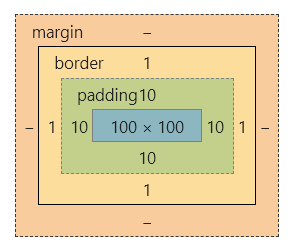

*注：本笔记为《CSS Mastery》的阅读学习笔记，主要简述CSS各种用途用法及其他理论知识，仅为查阅所用，工具及属性具体用法不做赘述。*

# 一 基础知识

CSS的初衷是提取出HTML中的表现性标记，使结构与表现分离。

**渐进增强 (progressive enhancement)：首先为最小公分母准备可用内容，再为支持新特性的浏览器添加更多交互优化。**对HTML而言，这意味着应使浏览器在遇到未知元素或属性时不会报错，也不会对页面产生影响；而对CSS而言，要在浏览器无法识别某些属性或值时提供合理的后备声明。

通过在标准名称前添加厂商指定的前缀字符串，可以特定某些浏览器识别对应的实验性特性。`-webkit-`前缀适用于如Safari、Chrome、Opera等基于WebKit的浏览器；`-moz-`前缀适用于基于Mozilla的浏览器如Firefox；`-ms-`适用于IE。最后应再加上一条不带前缀的声明给支持标准属性的浏览器。

若想==根据浏览器是否支持某个CSS特性来提供不同的样式==，使用**`@supports`**块，使用格式如：`@supports(display:grid) {}`。这个特殊的代码块称为条件规则，只有浏览器支持括号中的声明时，块中的规则才会被应用。但问题是其自身也不支持旧版本浏览器。

要在正确的地方使用正确的元素，使用**语义化标记**是优秀HTML的基础，结构良好的标记便于搜索引擎搜索，也便于增加CSS样式。编写CSS时，建议先给网站增添一组“基础”样式，再添加元素时，就不必再写样式。

==class的命名应表达组件类型==，而不应体现视觉样式。对于只能应用于一个元素的ID属性，应使其标识特定模块中的特定实例。实际开发中，用类来添加样式代码会更易于维护，==ID通常用于标识元素而不用于添加样式==。

HTML5结构化元素：section、header、footer、nav、article、aside、main。

~~扩展HTML语义：ARIA的role属性、微格式、微数据。~~<!--没太看懂，需要再次查阅相关资料理解。-->

[Can I use](https://www.caniuse.com/)网站可搜索属性查看支持浏览器百分比。使用Modernizr库可向前兼容老旧浏览器。

# 二 添加样式

## CSS选择符

- 类型选择符：`某元素`，选中某一类所有元素；
- 后代选择符：`父代 后代`，选中该父代的全部对应后代；
- ID选择符：`#ID名`，选中I拥有该ID属性元素；
- 类选择符：`.类名`，选中拥有该class属性元素；
- 子选择符：`父代>子代`，选中该父代的直系对应后代；
- 同辈选择符 (==同辈均拥有共同父元素==)：
  - 相邻同辈：`左元素+右元素`，选中某元素后面的相邻元素；
  - 一般同辈：`左元素~右元素`，选中某元素后所有元素；
- 通用选择符：`*`，匹配任何元素 (一般不建议用其来删除默认边距，最好还是明确指定元素来设定，或使用某些库)；
- 属性选择符：`元素[属性]`，可以根据是否存在某属性来选择，也可以根据特定属性值选择`元素[属性="值"]`，还可以应用匹配模式，如：
  - `a[href^="http:"]`：**`^`**匹配某些字符==开头==的属性值；
  - `img[src$=".jpg"]`：**`$`**匹配某些字符==结尾==的属性值；
  - `a[href*="/about/"]`：**`*`**匹配==包含==某些字符的属性值；
  - `a[rel~=next]`：**`~`**匹配以==空格分隔==的字符串中的属性值；
  - `a[lang|=en]`：**`|`**匹配开头为指定值或指定值后连接短线的情况；
- 伪元素：想选择的区域不是通过元素表示时可以通过伪元素来选择：
  - `::first-letter`：选择第一段文本的第一个字符；
  - `::first-line`：选择一段文本的第一个行；
  - `::before`：在元素前创建一个伪元素；
  - `::after`：在元素后创建一个伪元素；
- 伪类：想基于文档结构以外的情形来添加样式：
  - 超链接伪类
    - `:link`：未访问时；
    - `:visited`：访问过；
    - `:hover`：鼠标悬停时；
    - `:focus`：获得焦点时；
    - `:active`：活动状态时；
  - 目标与反选
    - `:target`：选择一个ID与当前URL片段匹配的元素；
    -  `:not()`：匹配不符合一组选择器的元素 ；
  - 结构化伪类
    - `:first-child`：选择第1个子元素；
    - `:last-child`：选择倒数第1个子元素；
    - `:nth-child(n)`：选择第n个子元素；
    - `:nth-last-child(n)`：选择倒数第n个子元素；
    - `:nth-of-type(n)`：选择第n个特定类型的子元素；
    - `:nth-last-of-type(n)`：选择倒数第n个特定类型的子元素；
    - `:only-child`：选择元素的唯一子元素；
    - `:only-of-type`：选择唯一特定类型的子元素；
  - 表单伪类
    - `:required`：选择拥有required属性的元素；
    - `:optional`：选择没有required属性的元素；
    - `:valid`：选择符合输入验证要求的元素；
    - `:invalid`：选择不符合输入验证要求的元素；
    - `:in-range`：选择值位于指定范围内的元素；
    - `:out-of-range`：选择值位于指定范围外的元素；
    - `:read-only`：选择不可被用户编辑的元素；
    - `:read-write`：选择可被用户编辑的元素；

## 层叠和特殊性

存在多个规则选择同一元素的情况时，CSS通过**层叠 (cascade)**机制来处理这种冲突。层叠机制的**重要性**级别如下：

- 标注`!important`的用户样式；
- 标注`!important`的作者样式；
- 作者样式；
- 用户样式；
- 浏览器 (或用户代码)的默认样式。

同级重要性则按选择符**特殊性**排序，如下：

- `!important`覆盖所有；
- 行内样式：1000；
- ID选择符：100；
- 类、属性选择符，伪类：10；
- 类型选择符，伪元素：1
- `*`：0；
- 继承的样式：小于0。

因样式表增大而被迫提高特殊性会使代码不必要地复杂化，最好==从一开始就简化选择符，降低特殊性==。

**继承**是指某些属性会直接应用到元素的后代。任何应用给元素的样式都会覆盖继承样式，因为继承样式没有任何特殊性。

**应用样式**

1. 直接使用`<style>`；
2. 使用`<link>`链接外部文件；
3. 使用`@important`加载外部文件。

样式声明的次序就是它们在HTML源码中声明的次序。

## 性能

1. 不要把CSS放在body里或放到页面底部；
2. 减少HTTP请求，线上网页最好把需要加载的CSS文件数量控制在2个以内，尽量不要使用`@important`；
3. 使用GZIP压缩线上资源，减少带宽占用，多数Web服务器都会在浏览器支持的情况下启用自动压缩线上资源；
4. 给`<script>`加上`async`或`defer`，不让浏览器渲染阻塞JS。

# 三 可见格式化模型

盒模型是CSS核心概念，所有元素都被看成一个矩形。padding用于分隔内容，使其不会散布到背景边界；margin在页面中控制元素间的距离。如下：

**`box-sizing`**属性可以改变计算盒子大小的方式，默认为content-box，意味着width和height的值仅为内容物content的大小。设置了`min/max-width`后，块级盒子能自动填充父元素宽度但不会收缩/扩大到限定宽度；设置高度则要慎重，最大高度应取决于包含的内容。

p、h1、article等块级元素以**块级盒子(block box)**形式显示；strong、span、time等行内元素则以**行内盒子(inline box)**的形式显示在行内。使用**`display`**可以改变生成的盒子类型，若设置为none那么浏览器不会为其生成盒子，即不显示其包含内容，不占用文档空间。

CSS有几种不同的定位模型：浮动、绝对定位、相对定位。默认所有盒子在常规文档流中生成，即**`position`**默认为static。块级盒子沿垂直方向堆叠，高度由margin决定；行内盒子沿文本流水平排列，高度不受任何设置影响。由一行文本形成的水平盒子叫**行盒子(line box)**，其高度由包含的行内盒子决定。若把display设置为**`inline-block`**，那么元素就会像行内盒子一样水平排列，内部仍像块级元素一样能够设置宽高和margin&padding。

块盒子内的夹缝内容也会生成块盒子，它无法被一般CSS选择符选中，称作**匿名块盒子(anonymous block box)**。类似的情况如某段落中包含三行文本，那么每一行都构成一个**匿名行盒子**。==屏幕上所显示的一切，均属于某个盒子。==

常规块盒子有一种叫**外边距折叠**的机制，无论什么情况，只要垂直方向上的两个margin相遇，都会以较大的那个为准折叠成一个。行内盒子、浮动盒子、绝对定位盒子的外边距不会折叠。

**包含块**是百分比值的计算依据，默认情况下，width/height/margin/padding的值为百分比时，就以该元素的父元素尺寸为计算依据，absolute元素的包含块是display属性为static以外值的祖先元素，若没有这样的元素那么相对于文档根元素(也叫起始包含块)html元素定位。

**浮动元素**会脱离文档流，若浮动元素后跟着常规元素，该元素盒子会当浮动元素不存在一样布局，元素内容却会避开浮动元素的空间，形成文本环绕效果。要阻止环绕，在对应行盒子上设置clear属性指明某侧不应紧贴浮动盒子。清除元素实际上是浏览器会在该元素上方添加足够大的外边距，将元素推到浮动元素下方，给“已清除”的元素添加外边距若未超过浏览器添加的值将没有效果。包裹浮动元素的元素无法生成高度，在其末尾添加一个空元素或使用`:after`伪类并为其指定clear可解决这个问题。

CSS为确定元素排布时互相的影响，有几套不同规则，其中一套叫做**格式化上下文(formatting context)**，分为[行内格式化上下文](https://developer.mozilla.org/zh-CN/docs/Web/CSS/Inline_formatting_context)和[块级格式化上下文](https://developer.mozilla.org/zh-CN/docs/Web/Guide/CSS/Block_formatting_context)。BFC规定必须自动包含突出的浮动元素，且所有块盒子的左边界默认与包含块的左边界对齐。有些规则允许元素建立自己内部的块级格式化上下文：

- display属性为inline-block或table-cell之类的元素；
- float属性不为none的元素；
- 绝对定位的元素；
- overflow属性值不是visible的元素。

# 四 网页排版

`font-family`的值是备选字体列表，包含空格的字体族最好加上引号。字型(typeface)也叫字体族，是一组代表字母、数字及其他统一样式的字形(glyph)的集合，字体(font)通常指存有某种字形表示的文件。

默认`font-size`为16px，通常不修改默认值，而是通过其他缩放因子来调整特定元素。em基于元素自身计算到的font-size，而rem始终基于根元素缩放。

`line-height`指定行盒子总高度，即行高；`font-weight`设置文本粗细；`font-style`指定字体样式如斜体。`text-transform`控制英文字母大小写；`font-variant`将字母设置为小型大写字母。`word-spacing`增减词间距；`letter-spacing`控制字符间距；`text-indent`设置首行缩进；`text-align`控制文本方向；`text-justify`在text-align为justify时修改两端对齐方式。`hyphens`设置自动在换行处插入连字符。`columns`是`column-count`和`column-width`的简写，前者指定栏数，后者指定栏宽；`column-gap`设置栏间距，`column-span`设置元素跨栏。

[@font-face](https://developer.mozilla.org/zh-cn/docs/web/css/@font-face)规则指定浏览器下载Web字体的服务器地址及如何引用，其中包含的声明并不会改变字体，而是指定在何种情况下触发使用这个字体文件。

OpenType字体格式支持在字体文件中包含字体的额外设定和特性，如连字、饰线等，CSS也有一些与其对应的属性，此处不赘述。

`text-shadow`给文本绘制阴影，需指定相对于文本的x/y轴偏移量，模糊距离及颜色值，可用逗号分隔指定多组阴影。阴影绘制开销较大不可滥用。

# 五 装饰盒子

描述**颜色**可使用十六进制法，由3组共6位数字组成，分别表示RGB3个通道值，若每组的2个数字相同则可简写，如“#663399”简写为“#639”。还可以使用`rgb()`和`hsl()`函数，前者使用十进制RGB值，后者使用HSL模型描述，`rgba()`和`hsla()`在颜色的基础上增加对透明度的控制。`opacity`单独控制元素透明度。

**位图**意味着文件会包含每个像素的数据，JPEG、PNG、GIF是位图格式。JPE是有损压缩，压缩率越高细节损失越多，不支持透明度。PNG是无损压缩，作为照片会很大，支持透明度设置；GIF是早期位图格式，除动图外已PNG取代，支持透明度但不支持阿尔法分级，因此会有边缘锯齿SVG是矢量图形格式，本身也是一种标记语言，可直接嵌入网页。WebP是Google开发的新格式，结合了JPEG的高压缩率和PNG的透明特性，目前的支持参差不齐。

`background-image`加载背景图片，可一次性加载多张，先声明的在最上面；`url()`可解析路径。`background-repeat`控制图片是否重复，默认为repeat。`background-position`设置图片位置，用法多且杂具体见[MDN](https://developer.mozilla.org/zh-cn/docs/web/css/background-position)；其中，当值为百分比时表示图片的x%处应与容器的x%处重合，使用`calc()`可以计算任何数值(操作符两侧要加空格)。`background-clip`指定背景图片在盒子中延伸到margin/padding或其他。`background-origin`控制图片原点(左上角)位置。`background-attachment`控制图片是否随页面/元素滚动。`background-size`设置图片尺寸和比例。**`backgroung`**可一次性简写。

`border-radius`设置圆角，百分比相对于元素宽高而定。`border-image`支持使用其他图片自制边框。`box-shadow`为元素添加阴影，可添加多组。

`linear-gradient()`绘制线性渐变；`radial-gradient`绘制放射渐变。这两个函数有绘制重复渐变的版本。

`object-fit`指定[可替换元素](https://developer.mozilla.org/zh-CN/docs/Web/CSS/Replaced_element)应该如何自适应到边框。CSS规定：对于没有指定大小的可替换元素，最终默认大小为150或300px。

# 六 水平布局

`z-index`设置堆叠元素的次序。position为absolute、z-index值不为auto、opacity小于1等元素，会创建自己后代元素的堆叠上下文，仅在这个上下文中堆叠，无论子元素z-index值如何变化都不会越界到其他元素上/下层。

` vertical-align`设置元素垂直对齐方式。margin为负值是有效的，会出现一些不同的行为。行盒子内的任何空白符(包括源码内的换行)都会渲染为一个空格，把元素容器的font-size设置为0即可消除。

## Flexbox

Flexbox，即Flexible Box Layout模块，包含针对弹性容器和针对其直接子元素(弹性项，flex item)的两类属性。Flexbox可以控制弹性项的大小、流动方向、两条轴上的对齐与分布、排列顺序。

**容器属性**

`flex-direction`定义了**主轴(main axis)**方向(**辅轴(cross axis)**与其垂直)，指明元素如何在容器中布局。项目默认排列在一条线上，`flex-wrap`定义一条轴线排不下时如何换行。 `flex-flow`简写前二者。`justify-content`指定项目在主轴上的对齐方式。`align-items`指定项目在辅轴上的对齐方式，默认stretch填满所有空间。`align-content`定义多辅轴的对齐方式。

**项目属性**

`order`定义项目排列顺序(无视源码)。`fex-grow`和`flex-shrink`设置多余空间的分配系数从而放大/缩小项目；`flex-basis`定义分配多余空间前项目的本身大小；`flex`是前三者的简写。`align-self`设置单个项目的对齐方式，可覆盖已有align-items的值。

# 七 页面布局&表格

网格系统是设计师在切分布局的时的参照，行&列间的空白叫空距(gutter)，行&列相交形成的单元格，成为单元(unit)或模块(module)，单元构成的区块称作区域(field)或范围(region)。

**固定布局**指页面具有特定的宽度；**弹性布局**指布局元素的尺寸使用em单位，即使用户缩放文本大小，布局的比例也不变；**流式布局**指页面元素会按比例缩放，但元素与元素间的比例甚至距离都保持不变。让页面能响应环境适应不同设备的设计方法叫**响应式Web设计(responsive Web design)**。

## grid

采用网格布局的区域称为**容器(container)**，容器中的水平区域称作行(row)，垂直区域称作列(column)，行&列交叉区域为单元格(cell)。Grid布局的属性分为容器属性和项目属性。具体例见[阮一峰博客](http://www.ruanyifeng.com/blog/2019/03/grid-layout-tutorial.html)。

**容器属性**

display属性为`grid`或 ` inline-grid `会将该元素设置为网格布局，后者为行内网格。`grid-template-rows`和`grid-template-columns`划分设置行/列，可使用方括号指定每一根网格线的名字。

`grid-row-gap`和`grid-column-gap`分别设置行/列间距；`grid-gap`是二者的简写。 `grid-template-areas`命名区域，合并的格子定义为重名，不需要的区域使用"."忽略；区域命名后网格线自动命名为"区域名-start/end"。网格划分后子元素会按照顺序放置在网格内，`grid-auto-flow`定义这个顺序，默认"先行后列"即"row"。

 `justify-items`和`align-items`设置内容在单元格中的水平/垂直位置；`place-items`简写前二者。`justify-content`和 `align-content`控制整个内容在容器中的水平/垂直位置。不在划分单元格内的多余项，浏览器将自动新增多余网格；`grid-auto-columns`和`grid-auto-rows`就是用来设置浏览器创建网格的列宽和行高。 

注意：网格容器子元素(项目)的`float`、`display: inline-block`、`display: table-cell`、`vertical-align`和`column-*`等都将失效。单位**fr**指可用空间部分(fraction)。`repeat()`简写重复值，para1为重复次数。`auto-fill`自动以para2指定的宽度填充元素。`minmax()`指定长度范围。

**项目属性**

指定项目的边框定位在哪个网格线即可设置项目位置。`grid-column-start/gend`设置左右边框线。`grid-row-start/end` 设置上下边框线。`grid-column`和`grid-row`分别是前二者的简写。关键字`span`表示跨越网格，后跟格子数。`grid-area`指定项目放在哪个区域。

`justify-self`和`align-self`设置单元格内容的水平/垂直位置，仅作用于单个项目；` place-self `简写前二者。

# 十 变换

`transform`用于给元素应用变换，多重变换的值以空格分隔。变换默认以元素边框中心为原点，`transform-origin`用于控制原点。`translate()`接收坐标平移元素，也可使用`translateX/Y()`沿某一轴平移；`rotate()`设置元素旋转角度；`scale()`和`skew()`接收数值或角度控制元素2维变换，可用`scaleX/Y()`或`skewX/Y()`单独控制某一方向。`matrix()`指定由6个值组成的变换矩阵，通常用于JS控制调用。

`transition`是[四个属性](https://developer.mozilla.org/zh-cn/docs/web/css/transition)的简写，用于设置过渡应用的属性、时间、过渡方式、延迟。可同时指定多个属性，写法如下：`transition: box-shadow .15s, transform .25s;`。`steps()`para1指定把过渡过程切成几个步骤，para2指定是在start还是end时启动过渡。

